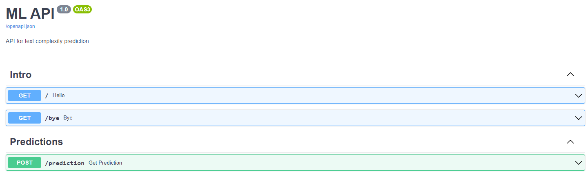
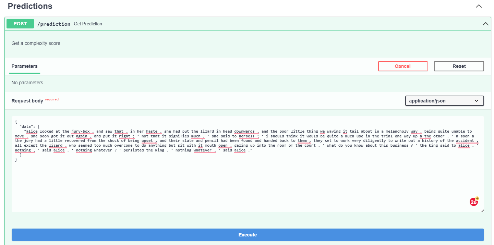
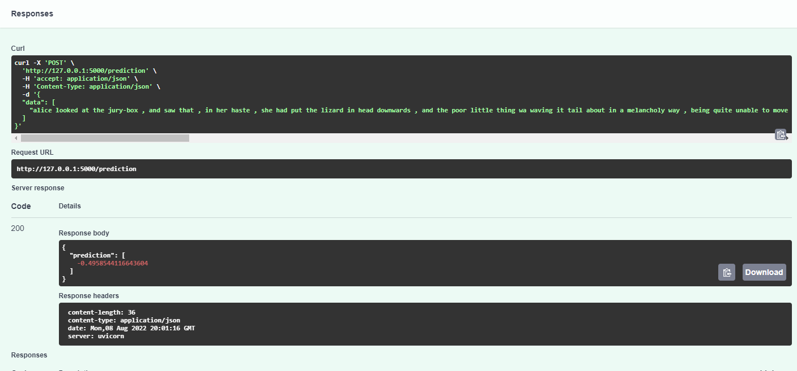

# CommonLit

This is the solution to the test assignment for Machine Learning in Production course.

## Installation
#### Requirement: Python 3.9

Download and unzip train.csv to data folder
```bash
unzip -d <your_proj_root_path>/CommontLit/data commonlitreadabilityprize.zip
```

Install required libraries
```bash
pip install -r requirements.txt
```

## Training

```bash
cd <your_proj_root_path>/CommontLit
set PYTHONPATH=%PYTHONPATH%;<your_proj_root_path>/CommontLit
python models/train.py
```

You'll have similar output:
```bash
--- Model: RidgeRegression ---
MSE:  0.5058024760410175
Training time: 0.9750237464904785

--- Model: LinearRegression ---
MSE:  9.965299798235974e+23
Training time: 7.216646671295166

--- Model: GradientBoostingRegressor ---
MSE:  0.8308028752067045
Training time: 11.585060596466064
```


## Get predictions

```bash
uvicorn app:app --port 5000
```

Go to http://127.0.0.1:5000/docs, your screen should look like this:



Let's sent a observations:



We'll get such response:



## Disclaimer
- This solution has been highly inspired by this [notebook](https://www.kaggle.com/code/ruchi798/commonlit-readability-prize-eda-baseline/notebook) in purpose to show an ability to run simple training code.
- Stop words and punctuation haven't removed intentionally during preprocessing. In the task of measuring text complexity, the degree of the noisiness of frequently used words, pronouns, and punctuation is important information for the model